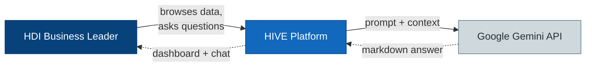
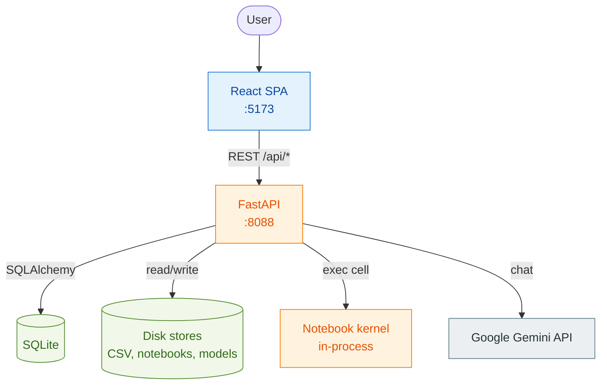
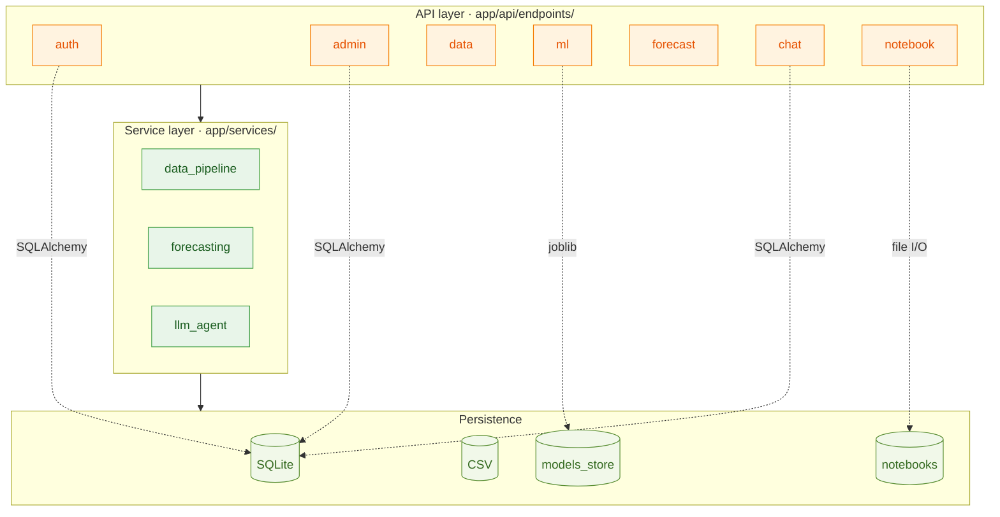
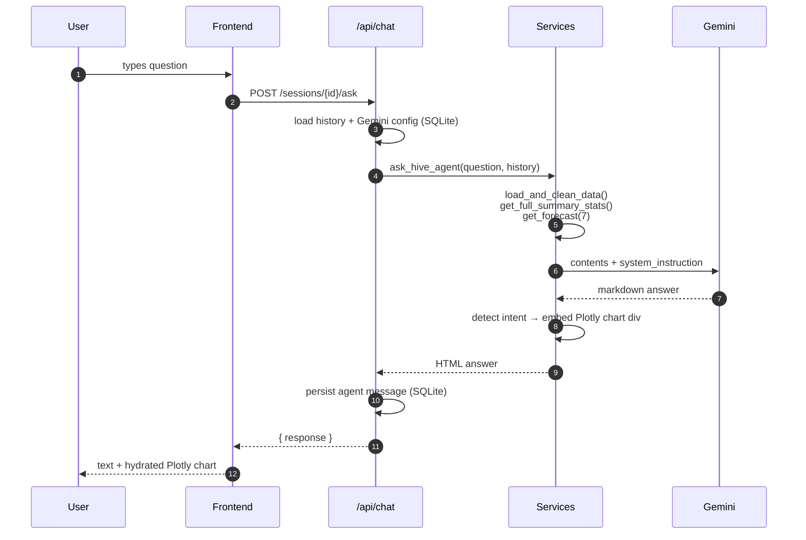
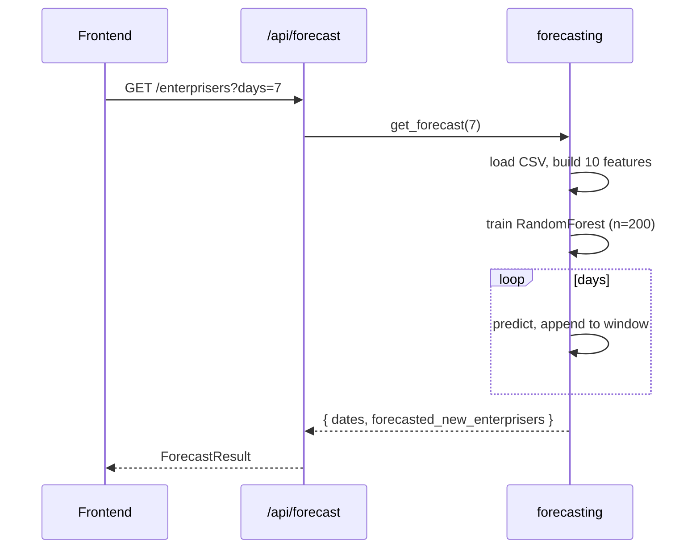
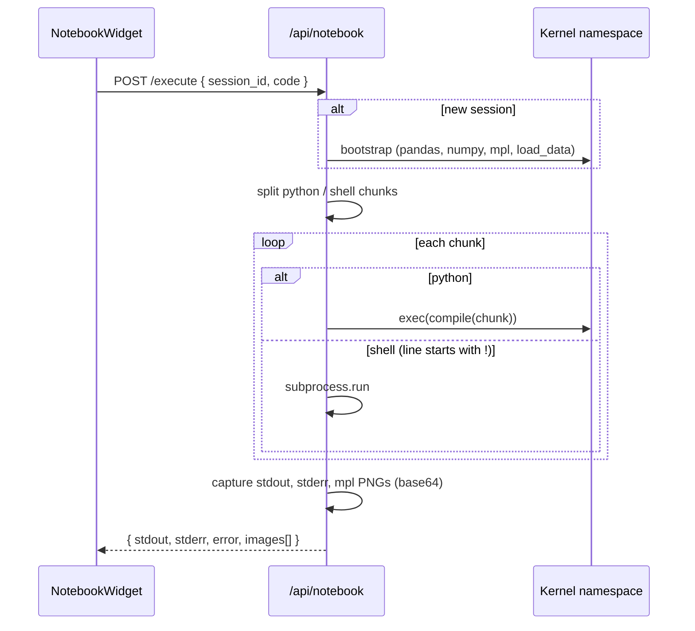
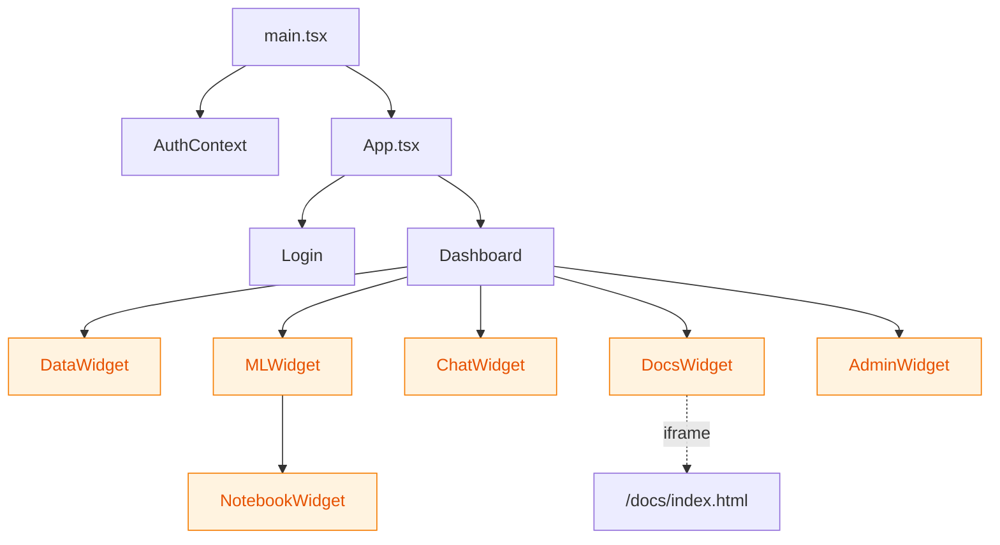

# Architecture

HIVE is a three-tier system: a React + Vite single-page app, a FastAPI backend, and an embedded in-process notebook kernel. State lives in a local SQLite file (`hive.db`) and on disk (CSV dataset, trained model artifacts, user notebooks). The only external dependency is the Google Gemini API, which is called on demand from the chat agent.

This document follows the C4 model — system context → containers → components → key data flows.

---

## C1 — System context

The user has no other touchpoints — there is no email notification, no scheduled report, and no upstream data feed. The CSV dataset is updated manually or via the ingest endpoint.

---

## C2 — Container view

Notes:

- **CORS is fully open** (`allow_origins=["*"]` in [app/main.py](app/main.py)) — fine for local development, must be tightened before any deployment.
- **The notebook kernel runs in the same Python process as the API.** Cell execution uses `exec(compile(...), namespace)` with a per-session namespace dict. There is no sandboxing — users can `import os`, hit the filesystem, or call shell commands via the `!` prefix.
- **SQLite is created on first request** by `Base.metadata.create_all(bind=engine)` in `main.py`.

---

## C3 — Backend components

### Endpoint-to-service map

| Router | Endpoints | Key services |
|---|---|---|
| `/api/auth` | `POST /login` | `User` model, password hash, JWT |
| `/api/admin` | `GET/POST /config` | `Config` model (Gemini API key + model name) |
| `/api/data` | `/summary`, `/table`, `/recent`, `/chart`, `/ingest` | `data_pipeline` |
| `/api/ml` | `/metrics`, `/train`, `/artifacts` | `data_pipeline`, sklearn, joblib |
| `/api/forecast` | `/enterprisers` | `forecasting` |
| `/api/chat` | session CRUD, `/sessions/{id}/ask` | `llm_agent`, `ChatSession`, `ChatMessage` |
| `/api/notebook` | `/execute`, file tree CRUD, kernel info | In-process namespace, file I/O on `notebooks/` |

---

## Key data flows

### Chat: user asks "Tunjukkan tren EP penjualan 30 hari terakhir"

The LLM never sees raw rows in the response body — only inside the system instruction. Plotly charts are pre-rendered server-side as JSON and base64-encoded into a `
` placeholder; the React side detects the placeholder and instantiates Plotly client-side.

### Forecast: `/api/forecast/enterprisers?days=7`

The forecast is **iterative**: each predicted value is appended to a rolling window of the last 14 observations, so day N+1's `lag_1` is day N's prediction. This compounds error but is the only way to forecast more than one step ahead without future ground truth.

Note: the model is retrained on every request (~100ms on this dataset). For production, swap to loading the latest `models_store/*.joblib` artifact and only retraining via `/api/ml/train`.

### Notebook cell execution

The kernel namespace persists for the session — variables defined in cell N are available in cell N+1. Clearing the session (`DELETE /session/{id}`) drops the namespace and the user starts fresh.

---

## Frontend structure

All widgets are self-contained — they fetch their own data via axios against `http://127.0.0.1:8088`. There is no global data store. The only shared state is the auth token (in `AuthContext`).

---

## Persistence model

| Store | Location | Schema / format | Lifecycle |
|---|---|---|---|
| User auth | `hive.db` → `users` | `id`, `email`, `hashed_password` | First-time login creates and sets password |
| App config | `hive.db` → `config` | `key`, `value` (rows for `GEMINI_API_KEY`, `GEMINI_MODEL`) | Updated by admin endpoint |
| Chat sessions | `hive.db` → `chat_sessions`, `chat_messages` | `id`, `title`, `role` (`user`/`agent`), `content`, `created_at` | Permanent until explicit delete |
| Operational data | `notebooks/data/*.csv` (latest mtime), fallback `data/hdi_daily_ops.csv` | Daily ops CSV — see column list in [app/services/data_pipeline.py](app/services/data_pipeline.py) | Appended via `/api/data/ingest` |
| Model artifacts | `app/models_store/model_v*.joblib` + `metadata.json` | Pickled `RandomForestRegressor` + metrics, features, timestamp | New version on each `/api/ml/train` |
| Notebooks | `notebooks/*.ipynb`, `notebooks/*.py` | nbformat 4.x or plain Python | Created / edited / saved via `/api/notebook` |
| Notebook kernel state | In-memory `_kernels: dict[session_id, namespace]` | Plain Python dict | Lost on server restart |

---

## Configuration

Settings live in [app/core/config.py](app/core/config.py) and load from a `.env` file if present.

| Setting | Default | Notes |
|---|---|---|
| `PROJECT_NAME` | `"HIVE API"` | Shown in OpenAPI title |
| `GEMINI_API_KEY` | `""` | Bootstrap value; in-app admin override takes precedence |

The Gemini model name is **not** in env settings — it is persisted in the `config` table via the admin UI.

---

## Known limitations

- **No sandbox on notebook execution.** Cells run in-process with full filesystem and network access. Acceptable for local single-user development; do not expose this endpoint publicly without isolation (Docker, gVisor, restricted user).
- **Model trained on every `/api/forecast` call.** Cheap on this dataset, expensive at scale. Production should serve from `models_store/` artifacts.
- **CORS is wide open** in `main.py`. Restrict before any deployment.
- **Single-user auth.** The login endpoint hard-codes `admin.hive@gmail.com` as the only allowed account.
- **Plotly chart embeds are HTML-in-text** — the agent answer is rendered with `dangerouslySetInnerHTML` semantics on the frontend. Any LLM output that contains a `
` will be parsed. Tight system instruction prevents abuse, but treat the boundary as untrusted.
