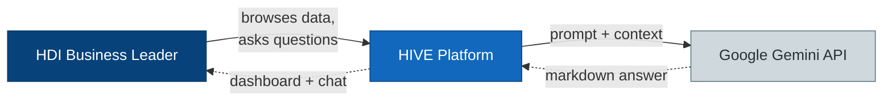
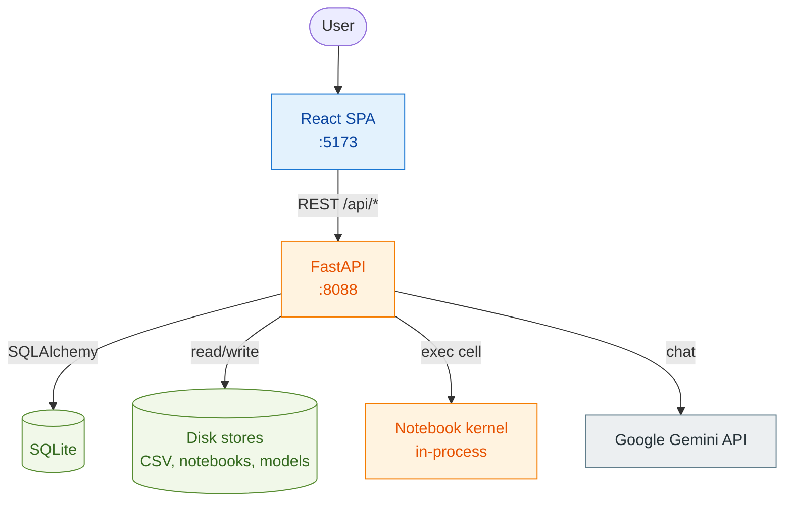
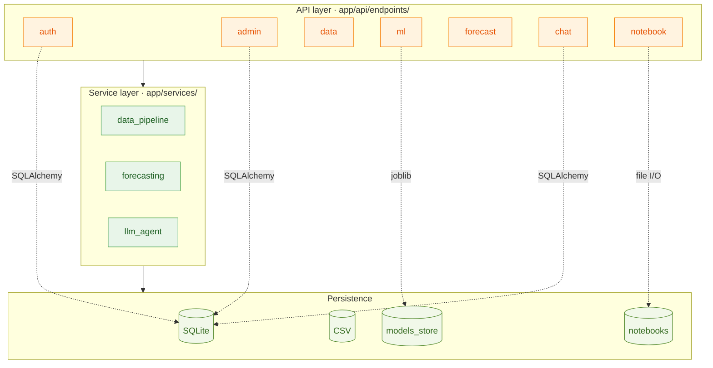
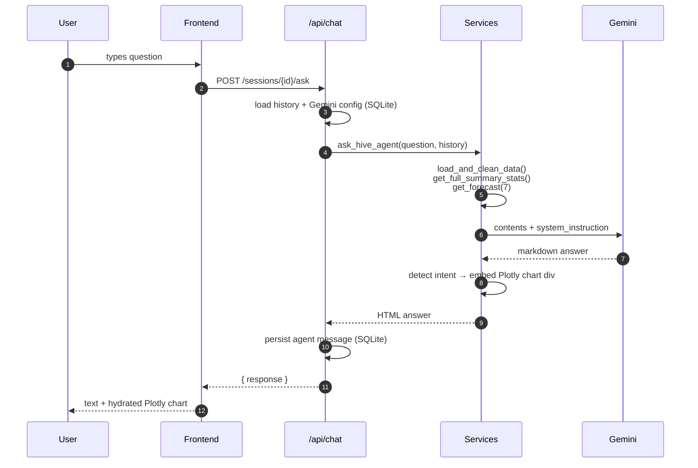
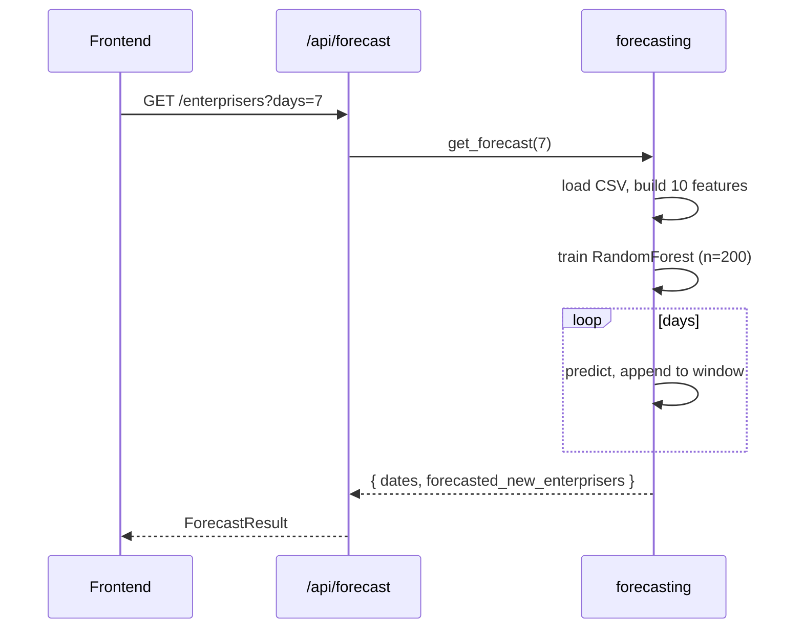
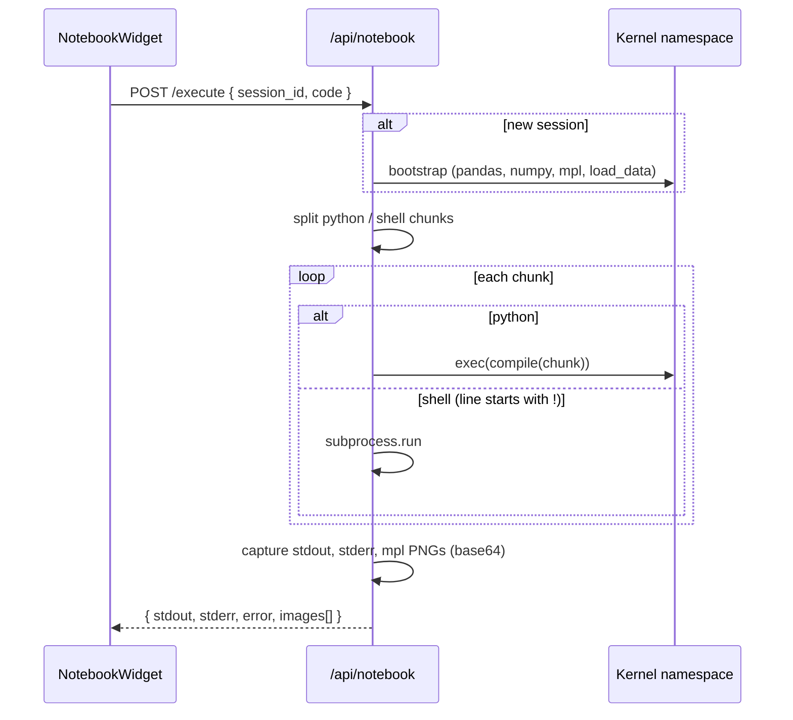
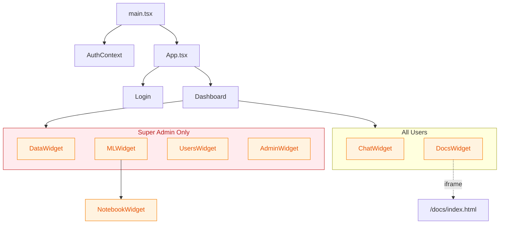

# Architecture

HIVE is a three-tier system: a React + Vite single-page app, a FastAPI backend, and an embedded in-process notebook kernel. State lives in a local SQLite file (`hive.db`) and on disk (CSV dataset, trained model artifacts, user notebooks). The only external dependency is the Google Gemini API, which is called on demand from the chat agent.

The platform supports multiple users with role-based access: **super admins** have access to all widgets (Data Management, MLOps, Gemini Agent, Documentation, Users, Settings), while **regular users** see only Gemini Agent and Documentation.

This page follows the C4 model — system context → containers → components → key data flows.

[[toc]]

## C1 — System context

The user has no other touchpoints — there is no email notification, no scheduled report, and no upstream data feed. The CSV dataset is updated manually or via the `/api/data/ingest` endpoint.

## C2 — Container view

The single API process owns: the FastAPI app, the in-process Python namespace each notebook session executes in, and all I/O against the disk stores. The only remote dependency is Gemini.

::: warning Trust boundary
The notebook kernel runs in the same Python process as the API and uses `exec(compile(...), namespace)` with no sandboxing. Users can `import os`, hit the filesystem, or call shell commands via the `!` prefix. Acceptable for local single-user development — must be sandboxed before any public deployment. See [Production considerations](/guide/production#2-notebook-cell-execution-is-unsandboxed).
:::

## C3 — Backend components

The backend has four layers. Each endpoint module delegates to one or two services; services own the actual logic and I/O.

The dotted edges show direct persistence access from routers that don't go through a service (auth/admin/chat write to SQLite via SQLAlchemy; ml writes joblib artifacts; notebook does its own file I/O).

### Endpoint-to-service map

| Router | Endpoints | Key services |
|---|---|---|
| `/api/auth` | `POST /login`, `POST /register`, `GET /me` | `User` model, password hash, JWT |
| `/api/admin` | `GET/POST /config`, user management | `Config` model, `User` model (super-admin only) |
| `/api/data` | `/status`, `/table`, `/chart`, `/upload`, `/ingest` | `data_pipeline` |
| `/api/ml` | `/metrics`, `/train`, `/artifacts` | `data_pipeline`, sklearn, joblib |
| `/api/forecast` | `/enterprisers` | `forecasting` |
| `/api/chat` | session CRUD, `/sessions/{id}/ask` (auth required) | `llm_agent`, `ChatSession`, `ChatMessage` |
| `/api/notebook` | `/execute`, file tree CRUD, kernel info | In-process namespace, file I/O on `notebooks/` |

## Key data flows

### Chat: user asks "Tunjukkan tren EP penjualan 30 hari terakhir"

The LLM never sees raw rows in the response body — only inside the system instruction. Plotly charts are pre-rendered server-side as JSON, base64-encoded into a `
` placeholder, then hydrated client-side.

### Forecast: `GET /api/forecast/enterprisers?days=7`

The forecast is **iterative**: each predicted value is appended to a rolling window of the last 14 observations, so day N+1's `lag_1` is day N's prediction. This compounds error but is the only way to forecast more than one step ahead without future ground truth.

The 10 features:

| Group | Features |
|---|---|
| Autoregressive lags | `lag_1`, `lag_3`, `lag_7`, `lag_14` |
| Rolling momentum | `rolling_mean_7`, `rolling_std_7` |
| Calendar | `dow`, `is_weekend`, `month` |
| Exogenous | `is_promo_period` |

Rolling stats use `shift(1)` before the window to prevent leakage of the current day's value into its own prediction.

### Notebook cell execution

The kernel namespace persists for the session — variables defined in cell N are available in cell N+1. `DELETE /notebook/session/{id}` drops the namespace.

## Frontend structure

The Dashboard filters navigation based on the user's role (`super_admin` or `user`). Regular users default to the Gemini Agent tab.

All widgets are self-contained -- they fetch their own data via axios. There is no global data store. The only shared state is the auth token and user profile in `AuthContext`.

## Persistence model

| Store | Location | Schema / format | Lifecycle |
|---|---|---|---|
| User auth | `hive.db` → `users` | `id`, `email`, `hashed_password`, `role`, `status` | Registration creates pending user; super admin approves |
| App config | `hive.db` → `config` | `key`, `value` (`GEMINI_API_KEY`, `GEMINI_MODEL`) | Updated by admin endpoint |
| Chat sessions | `hive.db` → `chat_sessions`, `chat_messages` | `id`, `user_id`, `title`, `role` (`user`/`agent`), `content`, `created_at` | Per-user; title auto-set from first 5 words of initial message |
| Operational data | `notebooks/data/*.csv` (latest mtime), fallback `data/hdi_daily_ops.csv` | Daily ops CSV | Appended via `/api/data/ingest` |
| Model artifacts | `app/models_store/model_v*.joblib` + `metadata.json` | Pickled `RandomForestRegressor` + metrics, features, timestamp | New version on each `/api/ml/train` |
| Notebooks | `notebooks/*.ipynb`, `notebooks/*.py` | nbformat 4.x or plain Python | Created / edited / saved via `/api/notebook` |
| Notebook kernel state | In-memory `_kernels: dict[session_id, namespace]` | Plain Python dict | Lost on server restart |

## Configuration

Settings live in `app/core/config.py` and load from a `.env` file if present.

| Setting | Default | Notes |
|---|---|---|
| `PROJECT_NAME` | `"HIVE API"` | Shown in OpenAPI title |
| `GEMINI_API_KEY` | `""` | Bootstrap value; in-app admin override takes precedence |

The Gemini model name is **not** in env settings — it lives in the `config` table via the admin UI.

## Known limitations

See [Production considerations](/guide/production) for the full list. Quick summary:

- Notebook execution is unsandboxed
- CORS is wide open in development
- JWT is enforced on chat endpoints; other routes still unprotected
- Model is retrained on every forecast request
